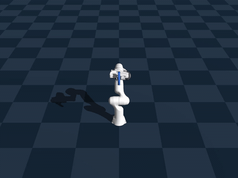
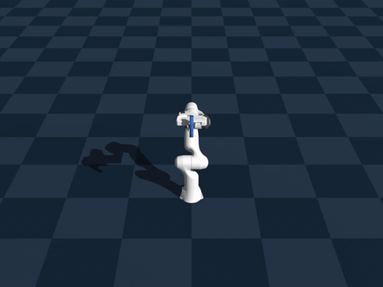
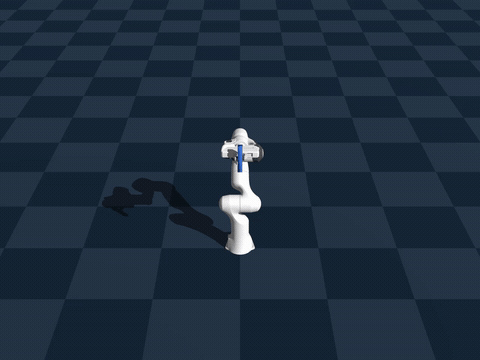

# Replaying a generated trajectory on the real Franka

How to reproduce, on hardware, the exact motion recorded in
`logs/franka-lift-v1-student-ft3/traj_vis/` by
[eval_pulse_grid_traj_franka.py](examples/rigid/eval_pulse_grid_traj_franka.py).

## Watch it first

The motion is not what "2 cm lift" sounds like — the bar never leaves the grasp,
and the hand ends up *lower* than it started. Everything below depends on seeing
that first.

<table>
<tr>
<td align="center"><br><b>d2_l4</b><br><sub>3 pulses · 1.10 s · hand −38 mm · slip +22 mm</sub></td>
<td align="center"><br><b>d2_l6</b><br><sub>2 pulses · 0.68 s · hand −56 mm · slip +19 mm</sub></td>
<td align="center"><br><b>d1_l3</b><br><sub>9 pulses · 2.40 s · hand −88 mm · slip +24 mm</sub></td>
</tr>
</table>

Each gif is one successful episode: the grasp point ratchets 2 cm along the bar,
one grip-release pulse at a time. `d2_l6` does it in two pulses, `d1_l3` needs
nine.

Full-resolution video for all twelve combinations is in
`logs/franka-lift-v1-student-ft3/traj_vis/traj_d<D>_l<L>.mp4` (50 fps, real
time); the gifs above are downsampled to 20 fps.

---

## 1. What is in the folder

Generated by:

```bash
docker exec genesis bash -c "cd /workspace && python3 examples/rigid/eval_pulse_grid_traj_franka.py \
  -e franka-lift-v1-student-ft3 --ckpt 1059 --delays 1 2 3 --lengths 3 4 5 6 \
  -B 1 --vis --record --max-steps 10000 \
  --out-dir logs/franka-lift-v1-student-ft3/traj_vis"
```

| file | contents |
|---|---|
| `traj_d<D>_l<L>.csv` | one successful episode, one row per 20 ms high-level step |
| `traj_d<D>_l<L>.mp4` | the same episode rendered at 50 fps (real time) |
| `summary.json` | checkpoint, env flags, column list, outcome counts per combination |

`D` = `PULSE_DELAY_STEPS`, `L` = `PULSE_LENGTH`, both in 20 ms steps. Policy:
`logs/franka-lift-v1-student-ft3/model_1059.pt`, a 14-observation student
distilled from the 2H teacher.

Every episode ended in the env's success condition at a pinned target of
**+0.02 m**, i.e. `|cuboid_rel_z − 0.02| ≤ 0.005` with a firm grasp held ≥ 3
steps, `|ee_vel_z| < 0.02`, and `0.7 ≤ ee_z ≤ 0.86`
([env_franka_parallel.py:847-854](examples/rigid/env_franka_parallel.py#L847-L854)).

| file | steps | duration | pulses | net EE Δz | final `cuboid_rel_z` |
|---|---|---|---|---|---|
| `traj_d1_l3` | 120 | 2.40 s | 9 | −0.0876 m | +0.0235 m |
| `traj_d1_l4` | 64 | 1.28 s | 3 | −0.0373 m | +0.0155 m |
| `traj_d1_l5` | 53 | 1.06 s | 3 | −0.0412 m | +0.0200 m |
| `traj_d1_l6` | 69 | 1.38 s | 3 | −0.0494 m | +0.0243 m |
| `traj_d2_l3` | 85 | 1.70 s | 4 | −0.0625 m | +0.0205 m |
| `traj_d2_l4` | 55 | 1.10 s | 3 | −0.0383 m | +0.0224 m |
| `traj_d2_l5` | 55 | 1.10 s | 3 | −0.0409 m | +0.0204 m |
| `traj_d2_l6` | 34 | 0.68 s | 2 | −0.0564 m | +0.0188 m |
| `traj_d3_l3` | 64 | 1.28 s | 3 | −0.0504 m | +0.0167 m |
| `traj_d3_l4` | 56 | 1.12 s | 3 | −0.0397 m | +0.0208 m |
| `traj_d3_l5` | 35 | 0.70 s | 2 | −0.0597 m | +0.0239 m |
| `traj_d3_l6` | 64 | 1.28 s | 3 | −0.1137 m | +0.0159 m |

---

## 2. What you are actually reproducing

The object is a **25 × 25 × 150 mm, 35 g plastic bar**
(`genesis/assets/xml/franka_emika_panda/box.xml`, MJCF friction 0.75; the env
randomizes effective contact μ over [0.6, 0.9]). It is held vertically between
the fingers for the whole episode — it is **never released into free flight and
never re-approached**.

"2 cm displacement" means the **grasp point moves 2 cm along the bar**:
`cuboid_rel_z` = (bar centre z) − (mean fingertip z) goes from ≈ 0 to +0.02 m.
The bar ends up 2 cm higher *in the hand*, and it gets there because the hand
drops **faster than the bar falls** while the grip is released. Note in the table
above that the end-effector always ends up 4–11 cm **lower** than it started, and
the net EE travel is several times the 2 cm of relative slip: a `traj_d2_l4`
episode moves the hand down 38 mm to gain 22 mm of grasp-point shift.

The gripper never opens geometrically. Per-finger command range is
`gripper_pos_min = 0.000251 m` to `gripper_pos_max = 0.0124 m`
([env_franka_parallel.py:171-172](examples/rigid/env_franka_parallel.py#L171-L172)), so even
fully "open" the finger pair spans 24.8 mm against a 25 mm bar. **The pulse is a
grip-force pulse, not an open/close motion** — see §6.

One cycle, read off `traj_d2_l4.csv`:

| rows | `grip_cmd_l` | what happens |
|---|---|---|
| 0–1 | 0.000251 (squeeze) | hand accelerates up to +0.56 m/s, bar rides with it |
| 2–6 | 0.0124 (released) | hand decelerates through zero and reverses to −0.60 m/s while the bar, no longer gripped, keeps falling at ~g — the hand outruns it downward |
| 7 | 0.000251 (squeeze) | re-grip: the bar is now higher in the hand |
| 8–19 | 0.000251 | zero-hold: z velocity forced to 0 and gripper forced closed for `zero_hold` steps, letting the grasp settle |
| … | | repeat until `cuboid_rel_z` reaches +0.02 |

So a real-robot replay must reproduce **three coupled things**: the z reference,
the grip-force schedule, and their relative timing to within one 20 ms step.

---

## 3. CSV format

One row per high-level step, `target_dt = 0.02 s` (50 Hz). Columns:

| column | meaning |
|---|---|
| `step`, `t_s` | step index and `step × 0.02 s` — see the timing note below |
| `target_z`, `target_z_vel`, `target_z_acc` | **the reference to replay** (world z, m / m·s⁻¹ / m·s⁻²) |
| `ee_z`, `ee_vel_z` | measured hand-frame z and z velocity |
| `cuboid_z`, `cuboid_rel_z` | measured bar centre z, and bar z − mean fingertip z |
| `desired_rel_z` | the goal, pinned to +0.02 in every one of these files |
| `grip_cmd_l`, `grip_cmd_r` | finger position actually commanded (m per finger) **after** the pulse override and the zero-hold — authoritative for grip phase |
| `finger_l`, `finger_r` | measured finger joint positions (pinned near 0.0125 by the bar) |
| `fingertip_dist` | distance between the two fingertip points |
| `pulse_steps` | pulse countdown **after** that step's decrement, so it reads one lower than the value that chose the phase; use `grip_cmd_*` to read the phase |
| `zero_hold` | zero-hold steps remaining |
| `act_z_vel` | raw policy z-velocity command, **before** the control-error bias |
| `act_grip_l/r` | raw policy gripper action, clamped to [−1, 1] |
| `reward`, `pulse_delay`, `pulse_length` | bookkeeping |

**Timing convention (important).** `t_s = step × 0.02` is the time at the *start*
of the step. The row's `target_z`/`target_z_vel` are the **endpoint** of the
segment that starts there, i.e. the reference at `t_s + 0.02`. The measured
`ee_z` on the same row is also sampled at `t_s + 0.02`, so target and measurement
on one row are mutually consistent — only the `t_s` column lags by one period.
Treat waypoint `i` as due at `(i + 1) × 0.02 s`.

**Recovering the initial waypoint.** The env integrates the reference with a
trapezoid, `z[i] = z[i−1] + 0.5·(v[i−1] + v[i])·T`
([env_franka_parallel.py:665](examples/rigid/env_franka_parallel.py#L665)), so the reference
point at `t = 0` (which is not a row) is exactly

```
z0 = target_z[0] − 0.5 · target_z_vel[0] · 0.02      # v(0) = 0 at reset
```

For `traj_d2_l4`: `0.85577 − 0.5 · 0.300 · 0.02 = 0.85277 m`. Prepend `(z0, 0)`
and you have the complete waypoint list.

---

## 4. What you send, given the controller you already have

This section assumes what you have on the robot today: **the same controller as
the sim** (cubic-Hermite expansion of the 50 Hz reference to 1 kHz, the 2nd-order
velocity low-pass, the DLS velocity IK), commanded with a **target z velocity**.
Under that assumption the replay is a column playback, and the only real work is
§4.3 and §5.

### 4.1 The command stream

Play the **`target_z_vel`** column, one row every 20 ms, in file order. That
column is exactly the signal the sim's controller received: it already contains
the per-episode control-error bias and the ±15 m/s² acceleration clamp baked in.

- **Do not** use `act_z_vel` — that is the raw policy output *before* the bias,
  and it is not what produced the motion in the video.
- Row `i` is the reference at `(i + 1) × 0.02 s` (§3). `t = 0` is the instant the
  arm is holding still at the start pose with the bar gripped.

**Publish at 1 kHz, not 50 Hz.** The CSV is a 50 Hz *waypoint* list; the sim
never fed those rows to the IK. It expanded each 20 ms segment to 1 kHz with the
cubic Hermite of §4.2 and low-passed it before the IK saw it. A controller that
zero-order-holds the last message — yours does — turns a 50 Hz stream into a
20 ms staircase instead. `franka_controllers/scripts/replay_traj_csv.py` does the
expansion for you (`~interp:=hermite`, default, publishing at `~rate:=1000`);
`~interp:=zoh` gives the 50 Hz staircase, which is how `policy.py` drives the
robot today.

**Send `target_z` as well if your controller keeps the position-error term.** The
sim commands `v_cmd = v_ref + 8.0 · (target_z − ee_z)`
([env_franka_parallel.py:1197-1201](examples/rigid/env_franka_parallel.py#L1197-L1201)),
so the velocity column alone is only half the loop. In these files the measured
`ee_z` sits 2–4 mm below `target_z` for the whole episode; with the position term
that error is held constant, without it the same error integrates and the hand
walks away from the reference over 30–120 steps. Either:

- send both columns and keep `pos_gain = 8.0` — what the sim did, and the exact
  match; or
- send velocity only, and re-zero the position against `target_z` at each pulse
  boundary so the drift cannot accumulate across cycles.

### 4.2 One detail worth double-checking in your controller

The velocity low-pass is the one place the env's own comment is wrong. The
constants in use give

```
H(s) = 160000 / (s² + 490 s + 160000)      ωn = 400 rad/s (63.7 Hz), ζ = 0.61
```

while the docstring three lines above them still reads
`9025 / (s² + 100.8 s + 9025)` (ωn = 95 rad/s, ζ = 0.53)
([env_franka_parallel.py:245-259](examples/rigid/env_franka_parallel.py#L245-L259)).
If you built your filter from the comment, it is roughly 4× slower than the sim's
and it will smear exactly the velocity reversal that the slip depends on. Trust
the constants.

### 4.3 z velocity alone reproduces the motion, not the result

The hand will move as in the video, and the bar will not move in the grasp. The
2 cm comes from the grip force releasing and re-engaging on the same 20 ms grid
as the velocity command — see §6. A velocity-only replay is a valid first test of
the arm path; it is not a replay of the task.

---

## 5. Procedure

1. **Start pose.** Drive to
   `q_home = [0.0, −0.82, 0.0, −2.180, 0.0, 2.9, 0.78] rad`
   ([env_franka_parallel.py:316-319](examples/rigid/env_franka_parallel.py#L316-L319))
   and let it settle (the sim holds it for 100 ms before `t = 0`). Freeze x, y and
   orientation there — only z moves for the whole episode.

2. **Grip the bar** vertically, near its middle, so that
   `cuboid_rel_z = bar_centre_z − mean_fingertip_z ≈ 0`. That datum is what the
   +0.02 m is measured against; if you start with the bar already high in the
   grasp you are measuring from the wrong zero.

3. **Pick a file.** Start with `traj_d2_l4.csv` — 55 steps, 1.10 s, 3 pulses,
   38 mm of hand travel, mid-pack on every count. Save the long ones
   (`d1_l3`, 9 pulses) for later.

4. **Arm both streams off one clock.** The `target_z_vel` row and the
   `grip_cmd_l/r` transition on the *same* row index must be issued in the same
   20 ms slot. Any fixed lag between the two streams shifts the release relative
   to the velocity reversal, which is the whole mechanism.

5. **Check your acceleration headroom first** (§9). The reference asks for up to
   0.30 m/s of velocity change per 20 ms step; a Panda's 13 m/s² Cartesian limit
   allows 0.26 m/s. This is not a rare corner: **29% of all steps across the 12
   files exceed 13 m/s²** (23–47% depending on the file), and they are
   concentrated on the velocity reversals inside the pulse windows — exactly the
   part that produces the slip. `replay_traj_csv.py` slew-limits to 13 m/s² by
   default and reports how many steps it touched.

6. **Stop at the last row.** The episode ends the step the success test passes;
   there is no settle-out tail in the file.

7. **Measure and tune.** Log `cuboid_rel_z` per pulse, not just at the end. Then:

   | symptom | likely cause | try |
   |---|---|---|
   | almost no slip | release force too high — the bar never goes free | lower the released-state force toward 0 N (sim's free threshold is 0.15 N avg) |
   | slip much larger than 2 cm | release too long, or re-grip too late | move to a shorter `L` file, or tighten the re-grip edge to the exact row |
   | slips then falls | re-grip force too low | raise the squeeze force within the 1–6 N band (§6) |
   | slip varies run to run | expected | the file is one draw of μ ∈ [0.6, 0.9] and kp ∈ [100, 500] N/m (§7); average over runs |

   Do not expect the first run to land on 2 cm. The arm motion reproduces
   exactly; the displacement is a contact outcome and has to be tuned in.

---

## 6. The gripper: a force pulse, not an open/close

The finger DOFs are position-controlled with a **per-episode randomized
stiffness** `kp ~ U[100, 500] N/m`, `kv = 25`, and force range clamped to `±kp`
([env_franka_parallel.py:1140-1153](examples/rigid/env_franka_parallel.py#L1140-L1153),
[:1325-1327](examples/rigid/env_franka_parallel.py#L1325-L1327)). Because the bar blocks the
fingers at ≈ 0.0125 m each, the commanded position sets a *force*:

| `grip_cmd` per finger | position error vs. the blocked finger | resulting squeeze |
|---|---|---|
| 0.0124 m ("open") | ≈ −0.0001 m | ≈ 0 N — **bar free to slide** |
| 0.000251 m ("closed") | ≈ +0.0122 m | `kp × 0.0122` = **1.2 – 6.1 N per finger** |

The env's own thresholds agree with that scale: below 0.15 N average finger force
counts as fully released, at/above 0.75 N as a firm grasp
([env_franka_parallel.py:123-124](examples/rigid/env_franka_parallel.py#L123-L124)).

**On hardware**, do not send `move`/width goals — a width command below the
object width is meaningless to `franka_gripper` and the timing will be wrong
anyway (the Franka Hand takes ~10× longer than 20 ms to execute a width change).
Instead:

- Use a **force-controlled grasp** and modulate the target force on the same
  20 ms grid: ~0 N (or the minimum your hand supports) while `grip_cmd == 0.0124`,
  and a fixed squeeze force in the 1–6 N band while `grip_cmd == 0.000251`.
- If the Franka Hand cannot switch force fast enough — it usually cannot at
  20 ms — **this task needs a faster end-effector** (a direct-drive or
  pneumatic gripper with a settable force setpoint). The pulse is 2–5 steps
  (40–100 ms) long; a hand that needs 100 ms to change grip force will smear the
  release across the entire pulse and the slip will not reproduce.

This is the single biggest sim-to-real risk in these trajectories. Validate the
gripper's force step response before spending time on the arm side.

---

## 7. What is *not* in the CSV

| quantity | status |
|---|---|
| control-error bias | **already baked into `target_z_vel`.** Each episode carries a constant `−U[0.03, 0.06] m/s` bias added before the acceleration clamp ([env_franka_parallel.py:1105-1120](examples/rigid/env_franka_parallel.py#L1105-L1120); note the sign line is commented out, so it is always downward). Replay `target_z*`, not `act_z_vel`, and you get it for free. |
| finger stiffness `kp` | **not recorded.** Drawn per episode from `U[100, 500] N/m`; it sets the squeeze force in the table above. Pick a force in the 1–6 N band and tune. |
| friction draw | **not recorded.** Effective contact μ per episode from `U[0.6, 0.9]`. |
| joint trajectory `q(t)` | **not recorded.** The CSV is a Cartesian z reference; joint angles come out of your own IK. |
| observation noise | ±0.003 m on the measured channels, irrelevant to replay (it perturbed the policy, and the policy's output is already in the file). |

To add `kp` (or joint angles) to the files, extend `STATE_COLS` and `state_row`
in [eval_pulse_grid_traj_franka.py](examples/rigid/eval_pulse_grid_traj_franka.py) and re-run —
the RNG is reseeded per combination, so the same `-B 1 --seed 1` command
regenerates the same episodes.

---

## 8. Verifying success on hardware

Reproduce the env's own test rather than eyeballing it. You need the bar pose
relative to the fingertips; the sim's fingertip point is the finger link origin
offset by `[0, 0.0055, 0.0445]` in the finger frame
([env_franka_parallel.py:326](examples/rigid/env_franka_parallel.py#L326)), and
`cuboid_rel_z = bar_centre_z − mean(left_tip_z, right_tip_z)`.

Success ⇔ all of:

- `|cuboid_rel_z − 0.02| ≤ 0.005 m`
- `|ee_vel_z| < 0.02 m/s`
- firm grasp (avg finger force ≥ 0.75 N) for ≥ 3 consecutive 20 ms steps
- hand z within its own [0.7, 0.86] band in the sim frame — on hardware, just
  bound the total downward travel (the table above shows 4–11 cm)

Failure in sim is `|cuboid_rel_x| > 0.04`, `|cuboid_rel_y| > 0.04`,
`fingertip_dist < 0.01`, `|cuboid_rel_z| > 0.15`, or the hand leaving
[0.6, 0.96] ([env_franka_parallel.py:855-862](examples/rigid/env_franka_parallel.py#L855-L862)).
The lateral ones are worth monitoring on hardware — that is the bar tipping out
of the grasp.

---

## 9. Limits and safety

Measured across all 12 files:

| quantity | peak in the data | Panda Cartesian limit |
|---|---|---|
| \|target_z_vel\| | 0.600 m/s | 1.7 m/s ✅ |
| \|target_z_acc\| | **15.000 m/s²** | **13 m/s² ⚠️** |
| \|Δacc/Δt\| at 50 Hz | 1352 m/s³ | 6500 m/s³ ✅ |

`Z_ACC_MAX = 15.0` ([env_franka_parallel.py:116](examples/rigid/env_franka_parallel.py#L116))
**exceeds the Panda's 13 m/s² Cartesian acceleration limit**, and the clamp is
saturated constantly in these episodes — the reference is at ±15 m/s² on many
steps. A verbatim replay will trip a Cartesian reflex or be clipped by the
controller, which changes the timing and therefore the slip. Options, in order of
preference:

1. Retrain (or re-collect) with `Z_ACC_MAX ≤ 13.0` so the policy learns inside
   the real limit. This is the only option that preserves the behaviour.
2. Rate-limit the replay to 13 m/s² and accept that the slip per pulse will be
   smaller — expect to need more pulses per 2 cm.
3. Slow the whole trajectory down by a factor `k` (time-scale `t → k·t`, so
   velocity scales `1/k` and acceleration `1/k²`). `k = 1.08` brings 15 → 12.9 m/s².
   **But** the slip physics depends on the hand outrunning free fall, so slowing
   down changes the outcome — this is not a free knob.

Also note the hand travels down 4–11 cm at up to 0.6 m/s during each episode.
Verify clearance below the start pose and keep a reduced velocity/force limit set
active for the first runs.

---

## 10. Regenerating

```bash
# same 12 episodes, headless, CSV only (fast: 64 parallel envs)
docker exec genesis bash -c "cd /workspace && python3 examples/rigid/eval_pulse_grid_traj_franka.py \
  -e franka-lift-v1-student-ft3 --ckpt 1059 -B 64"

# a different displacement, e.g. 3 cm
docker exec genesis bash -c "cd /workspace && python3 examples/rigid/eval_pulse_grid_traj_franka.py \
  -e franka-lift-v1-student-ft3 --ckpt 1059 -B 64 --desired-rel-z 0.03"

# several successful episodes per combination, to see the spread
docker exec genesis bash -c "cd /workspace && python3 examples/rigid/eval_pulse_grid_traj_franka.py \
  -e franka-lift-v1-student-ft3 --ckpt 1059 -B 64 --per-combo 5"
```

`--no-randomize`, `--no-zero`, `--no-control-error`, `--no-normalization` turn
off the corresponding env features; all four are **on** by default because
training used them. `-B 1` gives one episode at a time and needs a much larger
`--max-steps` (10000).

Trajectories are episode-specific: with domain randomization on, each file is one
draw of friction, finger stiffness and command bias, not an average. If you want
a trajectory robust to those, generate several per combination (`--per-combo 5`)
and pick one whose pulse count and travel sit mid-pack in the table in §1.
